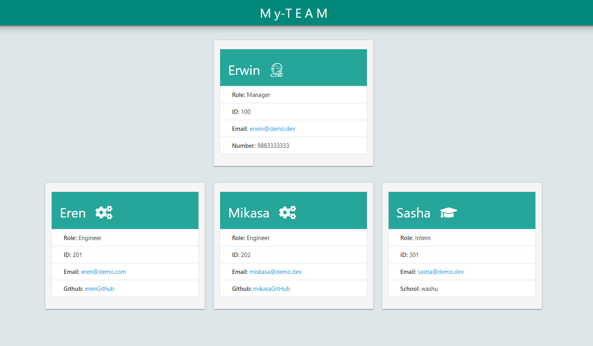

# Team Profile Builder

## Description  
A Node.js command-line application that takes in information about employees on a software engineering team, then generates an HTML webpage that displays summaries for each person.

## Table of Contents

- [Installation](#Installation) 
- [Usage](#Usage) 
- [Tests](#Tests) 
- [License](#License) 
- [Questions](#Questions)

## Installation
- Open terminal and change directory to application directory.
- install required depedencies with running: 
npm i

## Usage  
Open terminal and change to project directory and ( run node . ) and follow along answering the prompt questions to generate the team profile.

## Tests
node run test

## License

[MIT](https://opensource.org/licenses/MIT)

## Questions
Github: [@riheelh](https://www.github.com/riheelh/)  
